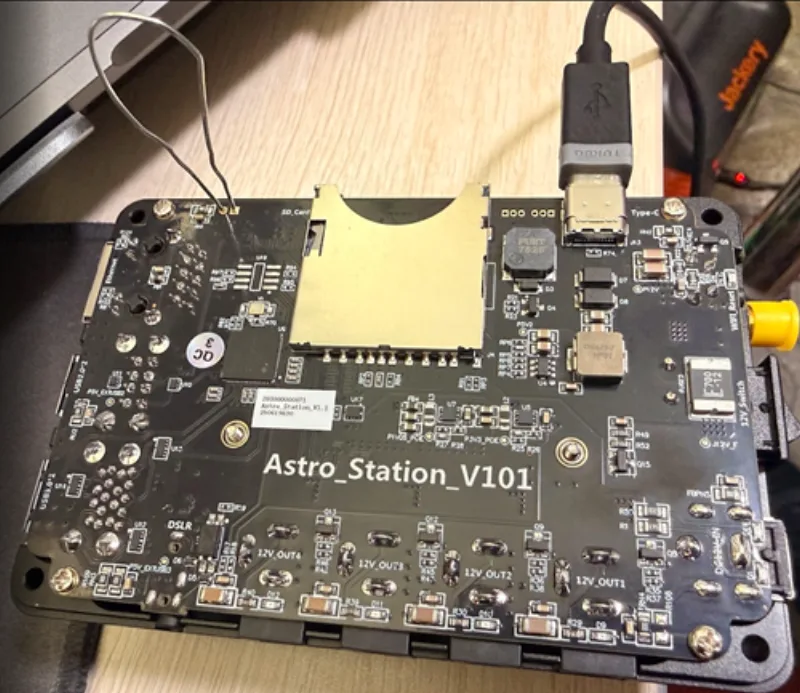

# OpenAstro for ToupTek StellaVita


OpenAstro OS for the **ToupTek StellaVita** (Raspberry Pi CM4 based): a
[Raspberry Pi OS Lite](https://www.raspberrypi.com/software/operating-systems/)
(arm64, no GUI, Debian 13 "Trixie") based image with the StellaVita's power
and USB hardware enabled, a WiFi access point, and everything ready for
[AlpacaBridge](https://github.com/open-astro/AlpacaBridge).

Everything from the
[StellaVita install guide](https://www.openastro.net/docs/sbc-install/touptek-stellavita)
is baked into the image:

- **12V power outputs** - GPIO 18, 10, 17, 4 driven high at boot via
  `config.txt`, so the DC outputs are live from power-on.
- **USB ports** - GPIO 9 and 11 power the Cypress USB hub, and the Renesas
  uPD720201 xHCI firmware (`renesas_usb_fw.mem`) is preinstalled and built
  into the initramfs, so the USB 3.0 ports work out of the box. The BCM2711's
  own USB 2.0 controller is enabled in host mode (`dtoverlay=dwc2` - vendor
  setup) for the internal USB 2.0 hub and microSD card reader.
- **Buzzer** - the OpenAstro jingle plays on the piezo (GPIO 12) once the
  board is up, so you know it's ready without a screen
  (`/usr/local/sbin/openastro-beep`).

The vendor unit's full hardware and software inventory - captured live from
a running StellaVita, with its original configs and scripts - lives in
[`hardware/stellavita-cm4-32g/`](hardware/stellavita-cm4-32g/).

## Supported hardware

| Device | Kernel | Status |
|--------|--------|--------|
| ToupTek StellaVita (Pi CM4) | Raspberry Pi OS stock | 🚧 Validation pending |

> **ZWO EAF/EFW:** the stock Raspberry Pi OS kernel ships with HIDRAW
> enabled, and the image bakes in a udev rule granting device access, so ZWO
> HID accessories should work out of the box.

## Install

The StellaVita has **no SD card** - the OS lives on the CM4's 32 GB eMMC,
reached over USB with [rpiboot](https://github.com/raspberrypi/usbboot). The
[`flash/`](flash/) scripts (Linux, macOS, Windows) handle the whole
workflow: install rpiboot, **back up the stock ToupTek OS**, flash the
OpenAstro image, and restore the stock backup later if you want.

> ⚠️ **Back up first.** The stock ToupTek/AstroStation OS is not available
> for download anywhere - the backup the script makes is your *only* way
> back to stock. Keep the `images/stellavita-stock-backup-*` file somewhere
> safe.

### 1. Get the scripts

Clone this repository (or use **Code → Download ZIP** on GitHub and
extract it):

```bash
git clone https://github.com/open-astro/openastro-touptek-stellavita.git
cd openastro-touptek-stellavita
```

### 2. Put the StellaVita in USB boot mode



1. Unplug the StellaVita (no DC power).
2. Open the case (back cover off the carrier board) and short the two
   **nRPIBOOT pads next to the SD-card slot** with a paperclip or jumper
   wire. Keep them shorted.
3. Connect a **USB-A (computer) to USB-C (StellaVita)** data cable - a
   charge-only cable won't work. The board powers up over USB; do **not**
   connect DC power.

The script pauses and walks you through this, so you can also start the
script first and follow its prompts.

### 3. Run the flash script

**Linux / macOS:**

```bash
cd flash
./openastro-flash.sh
```

**Windows:** open **PowerShell as Administrator** (Start menu → type
*PowerShell* → right-click → *Run as administrator*), change to the
repository folder, and run:

```powershell
powershell -ExecutionPolicy Bypass -File .\flash\openastro-flash.ps1
```

(`-ExecutionPolicy Bypass` lets Windows run the script without changing any
system-wide settings.)

Both show the same menu:

```
  1) Backup  - save the stock ToupTek OS from the eMMC (do this first!)
  2) Flash   - write the OpenAstro image to the eMMC
  3) Restore - write a stock backup back to the eMMC
```

Run **1) Backup** first, then **2) Flash**. Unplug and replug the USB
cable between runs (keep the pads shorted) so the board re-enters boot
mode - Flash also offers to make the backup for you if none exists.

Everything else is automatic: rpiboot installs on first use, Flash
downloads the latest release image (checksum-verified) if it isn't already
in `images/`, and every write is verified by reading it back off the eMMC.
Wait for **"Verification PASSED"**.

**Windows notes:**

- rpiboot comes from the official Raspberry Pi installer - accept its
  driver prompts. If the USB boot driver didn't install, the script
  installs it for you.
- The release image is `.xz`, which Windows can't open natively. The
  script uses the `xz.exe` that ships with
  [Git for Windows](https://git-scm.com/download/win), or
  [7-Zip](https://www.7-zip.org) - install either one if you have neither.
  The image is decompressed on the fly straight onto the eMMC; no extra
  disk space is needed.
- While the script runs it suppresses Windows' *"You need to format the
  disk"* popup. If one appears anyway, click **Cancel** - never Format.
  Windows just can't read the Linux partitions.

See [`flash/README.md`](flash/README.md) for more detail.

### 4. Boot OpenAstro

Disconnect USB, **remove the paperclip/jumper**, and connect DC power. The
12V outputs and USB ports come up with the board, and the buzzer plays the
OpenAstro jingle when it's ready.

To go back to stock later, enter boot mode the same way and choose
**3) Restore**.

## First boot defaults

| Setting | Value |
|---------|-------|
| Hostname | `openastro` |
| Login | `astro` / `astro` - **change immediately:** `passwd` |
| WiFi AP | `OpenAstro-XXXX` (2.4 GHz, ch 6), password `12345678` |
| AP address | `172.24.1.1` (DHCP for clients) |
| Ethernet | DHCP |

`XXXX` is the last 4 hex digits of the board's WiFi MAC address (e.g.
`OpenAstro-915D`), applied automatically on first boot so multiple boards in
the same place each get a unique hotspot name.

Reach it over ethernet (`ssh astro@<ip>`) or by joining the `OpenAstro-XXXX`
WiFi. The access point starts automatically at every boot, so even if the
board can't be reached over your network you can always join its hotspot and
log in at `172.24.1.1`.

### Connect to your own network instead (optional)

All networking is managed by NetworkManager. The hotspot runs on a dedicated
virtual interface (`ap0`), concurrent with `wlan0` client mode, so joining
your own network - from AlpacaBridge's WiFi card in the web portal, or with
`nmcli` (`sudo nmcli dev wifi connect <SSID> password <pass>`) - does **not**
take down the hotspot. (One radio, one channel: while connected as a client
the hotspot follows the client network's channel.) You can also just use the
ethernet port.

## AlpacaBridge

[AlpacaBridge](https://github.com/open-astro/AlpacaBridge) is **preinstalled**
from the OpenAstro apt repository, so the device works at a dark site straight
from the flash - no internet required. When the device does have internet, it
stays current with `sudo apt update && sudo apt upgrade`.

## Build the image yourself

The release image is built from a stock Raspberry Pi OS Lite (arm64) image
plus the OpenAstro layer. On an **aarch64** host (an arm64 Debian box, or a
Pi itself - it's a native chroot, no emulation):

```bash
# 1. grab the latest Raspberry Pi OS Lite arm64 image
wget https://downloads.raspberrypi.com/raspios_lite_arm64/images/raspios_lite_arm64-2026-06-19/2026-06-18-raspios-trixie-arm64-lite.img.xz

# 2. bake in the OpenAstro layer and repack
sudo apt install parted e2fsprogs dosfstools
sudo build/build-openastro-image.sh 2026-06-18-raspios-trixie-arm64-lite.img.xz images/openastro-touptek-stellavita.img.xz
```

- [`build/build-openastro-image.sh`](build/build-openastro-image.sh) - customizes
  the Raspberry Pi OS image in a chroot and produces a compressed, flashable
  `.img.xz`.
- [`openastro/openastro-setup.sh`](openastro/openastro-setup.sh) - the OpenAstro
  layer (StellaVita power/USB enablement, WiFi AP, baked-in credentials, ZWO
  udev rule). Idempotent; also runnable directly on a booted StellaVita.

## Sibling projects

- [openastro-raspberrypi](https://github.com/open-astro/openastro-raspberrypi)
  - same OpenAstro layer for the Raspberry Pi 3B+/4/5.
- [openastro-orangepi4pro](https://github.com/open-astro/openastro-orangepi4pro)
  - same OpenAstro layer for the Orange Pi 4 Pro (Allwinner A733).

## License

See [LICENSE.md](LICENSE.md).
