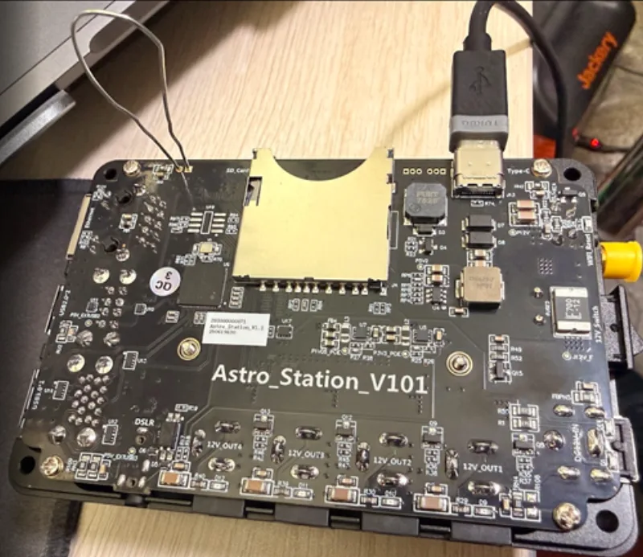

# Flashing the StellaVita

The StellaVita has **no SD card** - the OS lives on a 32 GB eMMC on the
Raspberry Pi CM4. To read or write it, the board is put in USB device-boot
mode and [rpiboot](https://github.com/raspberrypi/usbboot) (Raspberry Pi
usbboot) exposes the eMMC to your computer as a normal USB disk. The scripts
here wrap the whole workflow: install rpiboot, **back up the stock ToupTek
OS**, flash the OpenAstro image, and restore stock later if you want.

> ⚠️ **Back up first.** The stock ToupTek/AstroStation OS is not publicly
> downloadable. The `backup` command's output file is the *only* way back to
> stock - run it once before your first flash and keep the file somewhere
> safe.

## Scripts

| OS | Script |
|---|---|
| Linux, macOS | `openastro-flash.sh` |
| Windows | `openastro-flash.ps1` (elevated PowerShell) |

## Workflow

```bash
# Linux / macOS
./openastro-flash.sh install-rpiboot        # one-time
./openastro-flash.sh backup                 # -> images/stellavita-stock-backup-YYYYMMDD.img.xz
./openastro-flash.sh flash                  # writes images/openastro-touptek-stellavita.img.xz
./openastro-flash.sh restore <backup.img.xz>  # back to stock
```

```powershell
# Windows (Administrator PowerShell)
.\openastro-flash.ps1 install-rpiboot
.\openastro-flash.ps1 backup
.\openastro-flash.ps1 flash -Path ..\images\openastro-touptek-stellavita.img
.\openastro-flash.ps1 restore -Path .\stellavita-stock-backup-20260818.img.gz
```

Each backup/flash/restore run walks you through the same steps:

1. **Enter USB device-boot mode** - with the StellaVita unplugged, open the
   case (back cover off the `Astro_Station_V101` carrier board) and short
   the two nRPIBOOT pads **next to the SD-card slot** with a jumper wire,
   as in the photo below. Then connect a **USB-A (computer) to USB-C
   (StellaVita)** data cable. The board powers up over USB - no DC power
   needed (or wanted). The script pauses here and waits for you to press
   Enter, then rpiboot pushes the mass-storage gadget to the CM4 and the
   eMMC appears as a USB disk.

   
2. **Device safety checks** - the script identifies the eMMC as the disk
   that *newly appeared* (never guessed), refuses anything that isn't
   ~32 GB, and makes you re-type the device before touching it.
3. **Read or write**, with progress, checksums for backups, and a final
   sync/eject.


## Notes per OS

- **Linux**: rpiboot is built from source (needs `libusb-1.0-0-dev`; the
  script installs deps via apt). Backups are `.img.xz`.
- **macOS**: rpiboot comes from Homebrew (source-build fallback included).
  Uses `/dev/rdiskN` raw nodes for speed. Backups are `.img.xz`.
- **Windows**: `install-rpiboot` downloads the official installer (includes
  the boot driver) from the usbboot releases. Backups are `.img.gz` (native
  .NET gzip; no xz on stock Windows). To flash the released
  `openastro-touptek-stellavita.img.xz`, either decompress it with 7-Zip
  first or use [Raspberry Pi Imager](https://www.raspberrypi.com/software/)
  pointed at the disk rpiboot exposes.

## Restoring stock ToupTek

`restore` is just `flash` with your backup file: same boot-mode dance, same
safety checks, writes the saved image back, and the unit boots the original
AstroStation firmware as if nothing happened.
